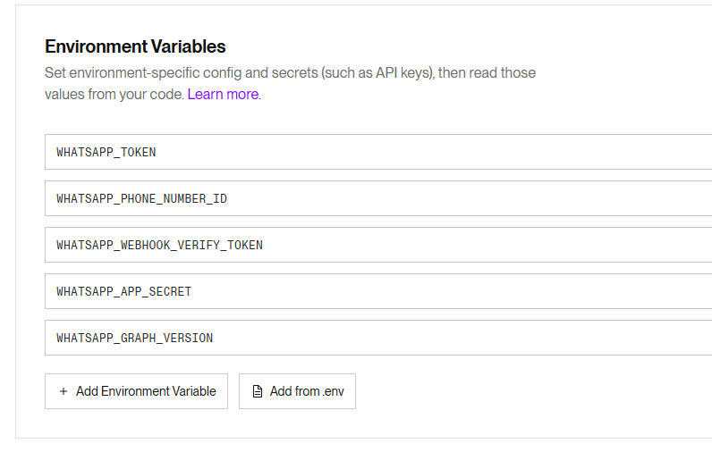

# MySpa Social Backend (Render)

Backend para WhatsApp. Está pensado para correr en **Render** como servicio Node (siempre encendido).

## Qué tiene que haber en el repo de Github(carpeta `Chat/`)

- `server.js`
- `package.json`
- `README.md` (esto)

Con eso Render hace `npm install` y `npm start` y listo.

## Variables de entorno para Render (Environment Variables)

Pon estas en el panel de Render (Environment):

- `WHATSAPP_TOKEN`
  - Token de WhatsApp Cloud API (permanente si puedes). Si lo cambias, el envío/descarga de media deja de funcionar.
- `WHATSAPP_PHONE_NUMBER_ID`
  - El Phone Number ID de tu número de WhatsApp Cloud.
- `WHATSAPP_WEBHOOK_VERIFY_TOKEN`
  - Un texto cualquiera (tipo `myspa-verify-123`) y el mismo lo pones en Meta cuando configuras el webhook.
- `WHATSAPP_APP_SECRET` (opcional pero recomendado)
  - App Secret de Meta. Si lo pones, el webhook valida la firma `x-hub-signature-256`.
- `WHATSAPP_GRAPH_VERSION` (opcional)
  - Ej: `v24.0`.

## Qué URL poner en Meta (webhook)

En Meta (WhatsApp -> Configuration -> Webhooks), la URL te queda:

`https://"URL de Render".onrender.com/api/whatsapp/webhooks`

Y el verify token es el valor de `WHATSAPP_WEBHOOK_VERIFY_TOKEN`.
