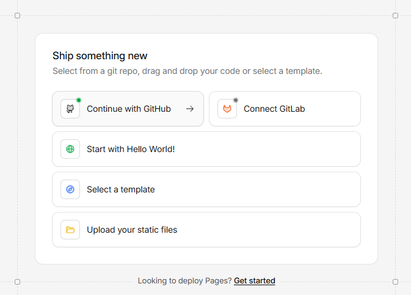

# MySpa Social Backend 

Backend para WhatsApp. Está pensado para correr en **CloudFlare Workers** como servicio Node (siempre encendido).

## 1 - Qué tiene que haber en el repo de Github(carpeta `Chat/`)

- `server.js`
- `package.json`
- `README.md` (esto)

## 2 - App en Facebook Developers para conectar WhatsApp, Facebook e Instagram

**2.a** - Primero debes crear una **FanPage** en **Facebook** sobre el negocio y agregar datos sobre el mismo. Tambien conectar con una cuenta de **Instagram**. Esto es necesario para crear el **Portfolio Comercial** y podeer acceder a la API de Facebook, Instagram y Whatsapp

**2.b** - Entra y haz login con tu cuenta de Facebook o crea una cuenta de desarrollador y crea una App en https://developers.facebook.com/ 

Aqui un video Ejemplo de Youtube:  https://www.youtube.com/watch?v=nivLx2_FJ60 

## 3 - En CloudFlare Workers Creas una cuenta gratuita [-> Cloudflare <-](https://dash.cloudflare.com/sign-up)

Estando en el **Dashboard** de CloudFlare, selecciona en **Add** / **Workers** y luego **Create a Worker**.

> |  

En las siguientes opciones, selecciona **Start With Hellow World**

  

  

Mas abajo en **Name variable** vas agregando las variables de entorno

- **WHATSAPP_TOKEN**
  - Token de WhatsApp Cloud API (permanente si puedes). Si lo cambias, el envío/descarga de media deja de funcionar.
- **WHATSAPP_PHONE_NUMBER_ID**
  - El Phone Number ID de tu número de WhatsApp Cloud.
- **WHATSAPP_WEBHOOK_VERIFY_TOKEN**
  - Un texto cualquiera (tipo `myspa-verify-123`) y el mismo lo pones en Meta cuando configuras el webhook.
- **WHATSAPP_APP_SECRET** (opcional pero recomendado)
  - App Secret de Meta. Si lo pones, el webhook valida la firma `x-hub-signature-256`.
- **WHATSAPP_GRAPH_VERSION** (opcional)
  - Ej: `v24.0`.

